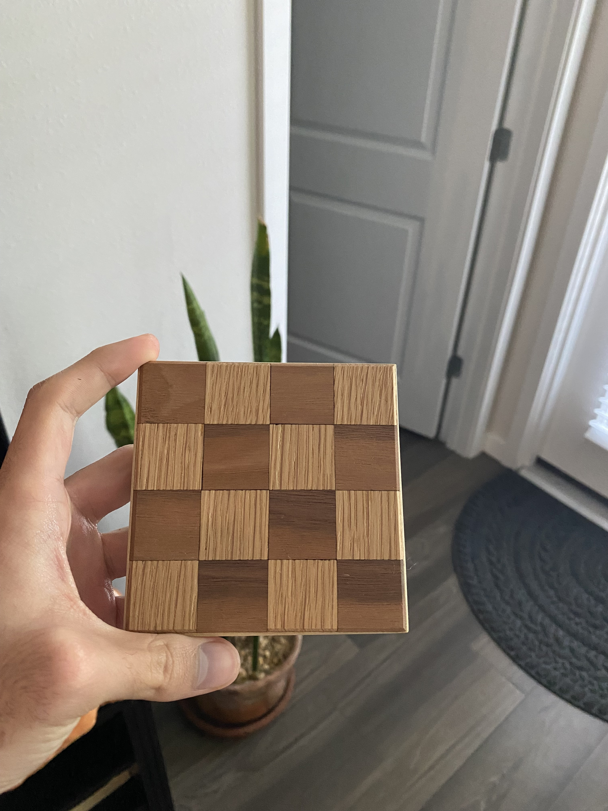

{/*
  DRAFT SCAFFOLD — no repo and no notes for this one, so this is structure, not content.
  Replace with what actually happened before shipping.

  Worth covering: why a chess board, what it's made of, which tools/processes
  (laser? CNC? hand-finished?), what went wrong, and whether it's in use.
*/}

A chess board, made as a coaster.

*(Needs writing from memory — one honest paragraph about making it.)*
