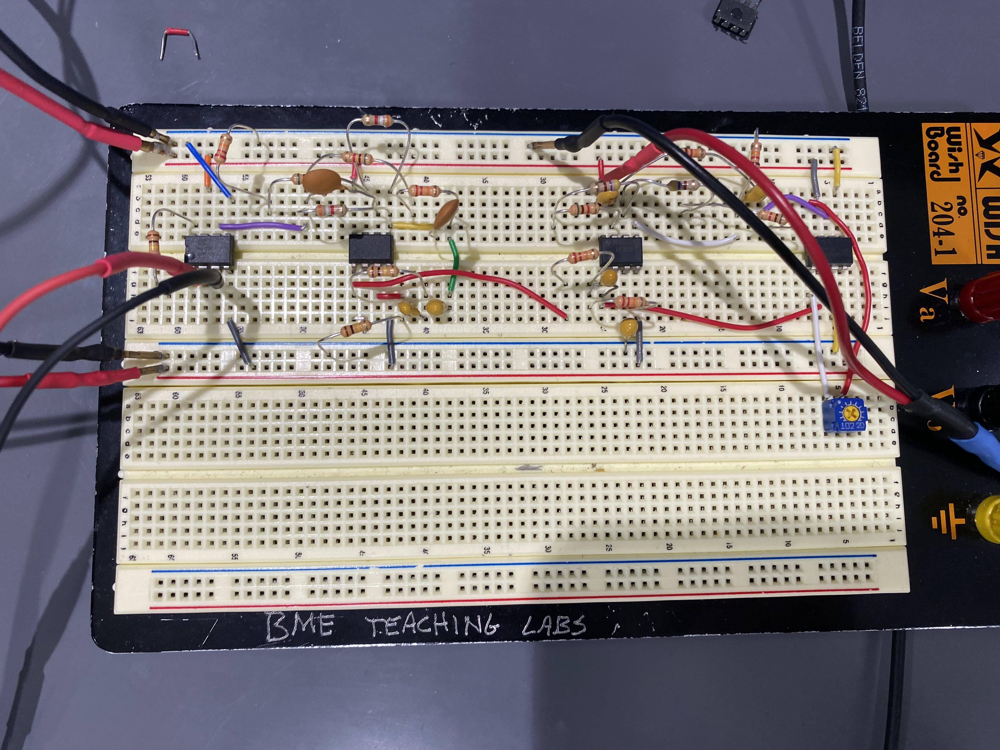

We set out to read minds and settled for reading faces. The name of the project is the story of the project.

The inspiration was a Michael Reeves video about driving a car with mind control. The plan was an EEG — electrodes on the scalp picking up alpha waves in the 8–12 Hz band, which get stronger when your eyes close and weaker when you concentrate. Detect the shift, decide whether someone is focused or relaxed.

Alpha waves are very small and the scalp is very noisy. Reading them properly needs an EEG cap with electrodes positioned precisely, and we had neither the cap nor the components to compensate. Rather than pretend, we moved the electrodes and changed the question: instead of brain state, detect a blink — which is a muscle firing, and a far larger signal. The device became an EMG.

The electronics were ours. Two instrumentation amplifiers to pull a differential signal off the body, a bandpass filter for the band we cared about, and a chain of notch filters to kill mains hum — which is the loudest thing in the room when you're measuring microvolts. The Pi Pico's ADC can't accept a signal centred on zero, so a shifting amplifier lifts it to sit inside the input range. Then peak detection in software, and an LED that lights the instant you blink. Electrodes ended up above the eyebrow, on the cheekbone, and behind the ear as a reference.

We took the wiring approach from a DIY guide but designed our own circuit and wrote our own acquisition and analysis code.

**The lesson was about scoping rather than filters.** We couldn't get the signal we wanted, so we changed which signal we were after and kept every piece of engineering that still applied. The amplification, the filtering, the level shifting and the detection all survived the pivot intact. Only the target moved.
