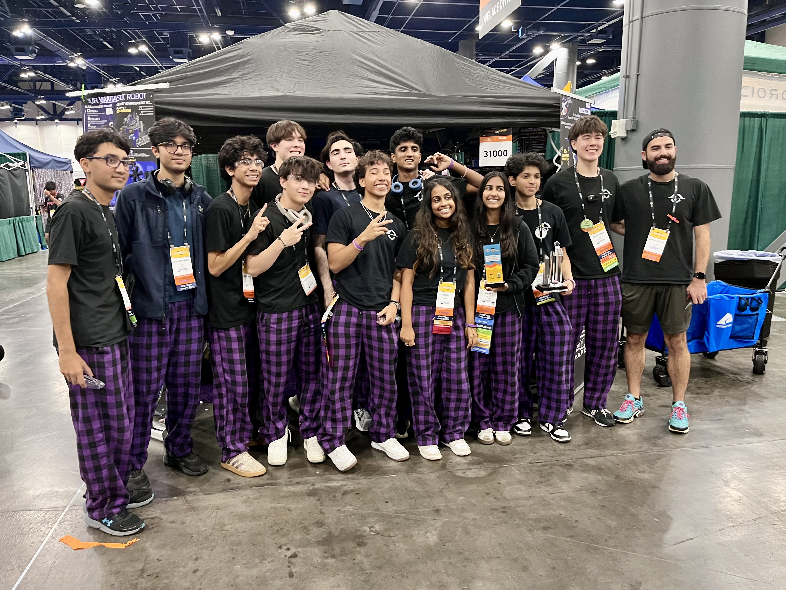
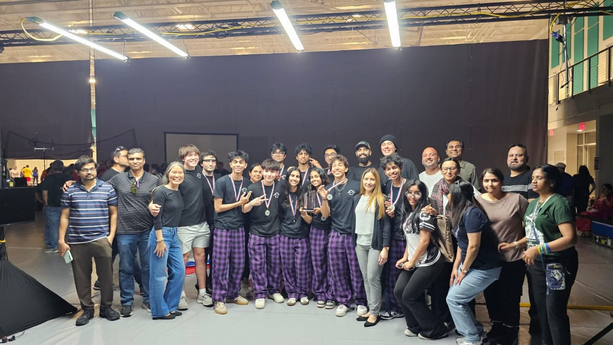

{/*
  WRITE THE STORY BELOW. A few hundred words, in your voice.
  Not a spec sheet — the inspiration, the process, what it actually did,
  what you learned, what went wrong.

  Drop a photo in wherever it belongs in the story:
      

  Link out mid-sentence, as a call to action:
      [click here to see the CAD](https://...)

  Photos currently in this folder:
  
  
  
  
  

  Delete this comment block when you start writing.
*/}

