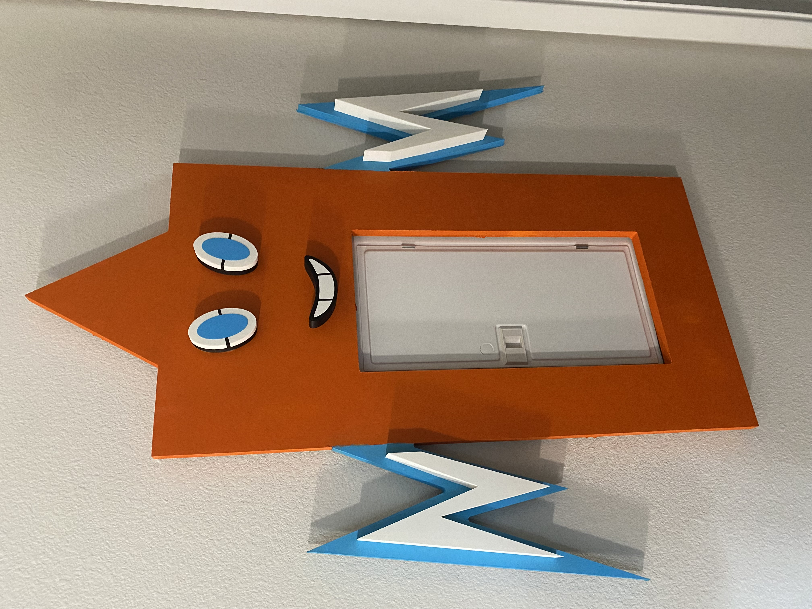

There is an ugly circuit breaker in the makerspace. There is now a Pokémon on it.

Rotom is a cover cut on the makerspace's wooden CNC — my first job on that machine — with 3D-printed eyes and lightning-bolt arms, held on by magnets so the whole thing lifts off when someone actually needs the breaker.

The appeal was that it solves a real problem in an unserious way. The breaker still has to open. Nobody wants to unscrew a decoration to reset a circuit, so the mount had to be magnetic from the start — that constraint came before the shape did. Rotom is a Pokémon that lives inside appliances and electrical equipment, which made the choice of character less arbitrary than it looks.

Three processes had to agree with each other: the CNC cut for the body, the printed parts for the eyes and arms, and the magnets tying it to a piece of hardware I didn't design and couldn't modify. Getting a cut part and a printed part to line up is a different kind of tolerance problem than getting either one right on its own.

*(Still to write: what the CNC actually taught me — what went wrong on the first cut, and what I'd do differently. That belongs here, in my own words.)*
